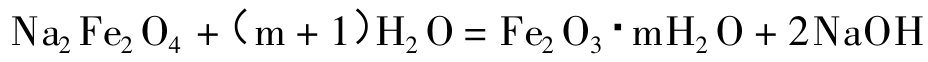
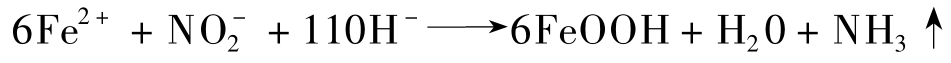
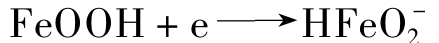
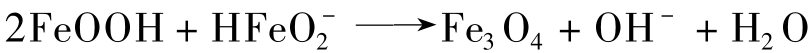
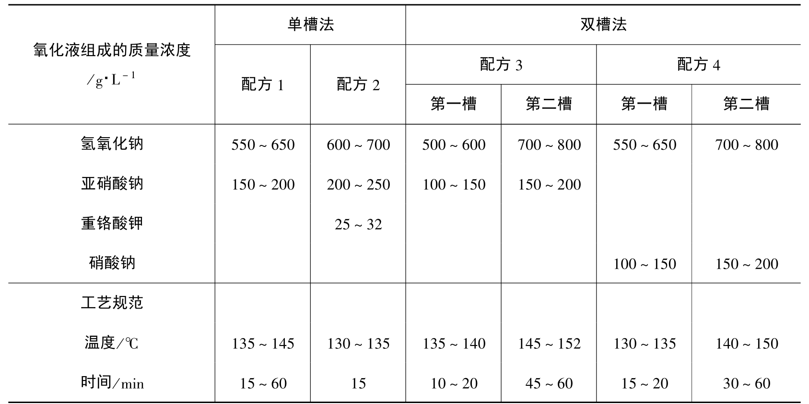
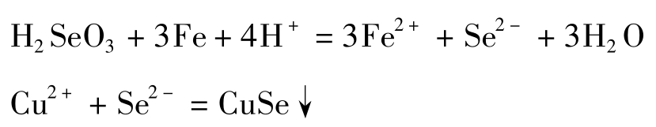

钢铁的发黑（又称发蓝）是指钢铁的氧化处理。将钢铁件浸入氧化溶液中保持一定的时间，在工件表面形成以磁性氧化物 Fe3O4为主要成分的氧化膜，再经皂化、填充或密封处理（需用肥皂液、浸油或经重铬酸溶液处），可提高零件的抗蚀性与润滑性。

膜层的色泽取决工件表面状态和材料的合金成分，以及氧化处理的工艺操作条件。一般呈蓝黑色或深黑色，含硅量较高的钢铁件氧化膜呈灰褐色和黑褐色。

发黑处理具有如下特点：

- 氧化处理时不析氢，故不会产生氢脆；
- 膜层的厚度约为 0.5~1.5μm。，对零件尺寸和精度无显著影响；
- 成本低、功效高；

钢铁的发黑处理广泛用于机械零件、精密仪表、汽缸、弹簧、兵器等的一般防护和装饰，但使用过程中应定期搽油。

钢铁的发黑处理一般可用化学、电化学等方法，目前生产中普遍采用的是高温碱性化学氧化法、高温酸性氧化法和常温氧化法等。

# 高温碱性化学氧化

高温化学氧化是传统的发黑方法， 采用含有亚硝酸钠的浓碱性处理液， 在 140℃ 左右的温度下处理 15min ~90min。高温化学氧化得到的是以 Fe3O4 为主的氧化膜， 膜厚一般只有 0.5~1.5μm，最厚可达 2.5μm。氧化膜具有较好的吸附性。将氧化膜浸油或作其他后处理，其耐蚀性能可大大提高。由于氧化膜很薄，对零件的尺寸和精度几乎没有影响， 因此在精密仪器、光学仪器、武器及机器制造业中得到广泛应用。

## 钢铁高温氧化的机理

钢铁在含有氧化剂的碱性溶液中的氧化处理是一种化学和电化学过程。

### 化学反应机理

钢铁浸入溶液后， 在氧化剂和碱的作用下，表面生成Fe3O4氧化膜，该过程包括以下三个阶段：

钢铁表面在热碱溶液和氧化剂（亚硝酸钠等）的作用下生成亚铁酸钠

亚铁酸钠进一步与溶液中的氧化剂反应生成铁酸钠

铁酸钠与亚铁酸钠相互作用生成磁性氧化铁

在钢铁表面附近生成的 Fe3O4 ，其在浓碱性溶液中的溶解度极小，很快就从溶液中结晶析出，并在钢铁表面形成晶核，而后晶核逐渐长大形成一层连续致密的黑色氧化膜。

在生成 Fe3O4 的同时， 部分铁酸钠可能发生水解而生成氧化铁的水合物.

含水氧化铁在较高温度下失去部分水而形成红色沉淀物附在氧化膜表面，成为红色挂灰，或称 “红霜” ，这是钢铁氧化过程中常见的故障， 应尽量避免。

### 电化学反应机理

钢铁浸入电解质溶液后即在表面形成无数的微电池， 在微阳极区发生铁的溶解

在强碱性介质中有氧化剂存在的条件下， 二价铁离子转化为三价铁的氢氧化物

与此同时， 在微阴极上氢氧化物被还原

随之，相互作用，并脱水生成磁性氧化铁。

### 氧化膜的成长

上面讨论了氧化膜的形成过程，氧化膜实际成长时，由于四氧化三铁在金属表面上成核和长大的速度不同，氧化膜的质量也不同。氧化物的结晶形态符合一般结晶理论，四氧化三铁晶核能够长大必须符合总自由能减小的规律，否则晶核就会重新溶解。  
四氧化三铁在各种饱和浓度下都有自己的临界晶核尺寸。四氧化三铁的过饱和度愈大，临界晶核尺寸愈小，能长大的晶核数目愈多，晶核长大成晶粒并很快彼此相遇，从而形成的氧化膜比较细致，但厚度比较薄。反之，四氧化三铁的过饱和度愈小，则临界晶核尺寸愈大，单位面积上晶粒数目愈少，氧化膜结晶粗大，但膜比较厚。 
因此所有能够加速形成四氧化三铁的因素都会使膜厚减小，而能减缓四氧化三铁形成速度的因素能使膜增厚。所以**适当控制四氧化三铁的生成速度是钢铁化学氧化的关键**。

## 钢铁高温氧化工艺

下表是钢铁高温氧化工艺，有单槽法和双槽法两种工艺。

单槽法操作简单，使用广泛，其中配方1为通用氧化液，操作方便，膜层美观光亮，但膜较薄；配方2氧化速度快，膜层致密，但光亮度稍差。

双槽法是钢铁在两个质量浓度和工艺条件不同的氧化溶液中进行两次氧化处理，此法得到的氧化膜较厚，耐蚀性较高，而且还能消除金属表面的红霜。由配方3可获得保护性能好的蓝黑色光亮的氧化膜，由配方4可获得较厚的黑色氧化膜。

### 氢氧化钠

提高氢氧化钠的质量浓度，氧化膜的厚度稍有增加，但容易出现疏松或多孔的缺陷，甚至产生红色挂灰；质量浓度过低时，氧化膜较薄，产生花斑，防护能力差。

### 氧化剂

提高氧化剂的质量浓度，可以加快氧化速度，膜层致密、牢固。氧化剂的质量浓度低时，得到的氧化膜厚而疏松。

### 温度

提高溶液温度，生成的氧化膜层薄，且易生成红色挂灰，导致氧化膜的质量降低。

### 铁离子含量

氧化溶液中必须含有一定的铁离子才能使膜层致密，结合牢固。铁离子浓度过高，氧化速度降低，钢铁表面易出现红色挂灰。对铁离子含量过高的氧化溶液，可用稀释沉淀的方法，将以铁酸钠及亚铁酸钠形式存在的铁变成 Fe(OH)3的沉淀去除。然后加热浓缩此溶液，待沸点升至工艺范围，便可使用。

### 钢铁含碳量

钢铁中含碳量增加，组织中的 FeC3增多，即阴极表面增加，阳极铁的溶解过程加剧，促使氧化膜生成的速度加快，故在同样温度下氧化，高碳钢所得到的氧化膜一定比低碳钢的薄。

# 钢铁的常温化学氧化

钢铁常温化学氧化一般称为钢铁常温发黑，这是 80 年代以来迅速发展的新技术。

与高温发黑相比，常温发黑具有节能、高效、操作简便、成本较低、环境污染小等优点。常温发黑得到的表面膜主要成分是 CuSe （硒化铜），其功能与 Fe3O4 膜相似。

## 钢铁常温发黑机理

常温发黑的机理到目前为止研究的尚不够成熟， 下面简单介绍一些观点。
多数人认为，当钢件浸入发黑液中时，钢铁件表面的 Fe 置换了溶液中的Cu2+，铜覆盖在工件表面。

覆盖在工件表面的金属铜进一步与亚硒酸反应，生成黑色的硒化铜表面膜。

也有人认为，除上述机理外，钢铁表面还可以与亚硒酸发生氧化还原反应，生成的 Se2+ 与溶液中的 Cu2+ 结合生成 CuSe 黑色膜。

尽管目前对发黑机理的认识尚不完全一致，但是黑色表面膜的成分经各种表面分析被一致认为主要是 CuSe 。

## 钢铁常温发黑工艺

下表是钢铁常温发黑液配方。常温发黑操作简单，速度快，通常为 2min~10min，是一种非常有前途的新技术。目前还存在发黑液不够稳定、膜层结合力稍差等问题。常温发黑膜用脱水缓蚀剂、石蜡封闭，可大大提高其耐蚀性。

常温发黑液主要由成膜剂、pH缓冲剂、络合剂、表面润湿剂等组成。这些物质的正确选用和适当的配比是保证常温发黑质量的关键。

### 成膜剂

在常温发黑液中，最主要的成膜物质是铜盐和亚硒酸，它们最终在钢铁表面生成黑色 CuSe 膜。在含磷发黑液中，磷酸盐亦可参与生成磷化膜，可称为辅助成膜剂。辅助成膜剂的存在往往可以改善发黑膜的耐蚀性和附着力等性能。

### pH缓冲剂

常温发黑一般将 pH 控制在 2~3 的范围之内。若 ph 过低，则反应速度太快，膜层疏松，附着力和耐蚀性下降。若 pH 过高，反应速度缓慢，膜层太薄，且溶液稳定性下降，易产生沉淀。在发黑处理过程中，随着反应的进行，溶液中的 H+ 不断消耗，pH 将升高。加入缓冲剂的目的就是维持发黑液的 pH 在使用过程中的稳定性。磷酸-磷酸二氢盐是常用的缓冲剂。

### 络合剂
常温发黑液中的络合剂主要用来络合溶液的 Pe2+ 和 Cu2+ ，但对这两种离手络合的目的是不同的。

当钢件浸入发黑液中时，在氧化剂和酸的作用下，Pe 被氧化成 Pe2+ 进入溶液。溶液中的 Fe2+ 可以被发黑液中的氧化性物质和溶解氧进一步氧化成 Pe3+ 。微量的 Fe3+ 即可与 Se0(2-/3)生成Fe2(Seo3)3白色沉淀，使发黑液浑浊失效。若在发黑液中添加如柠檬酸、抗坏血酸等络合剂时，它们会与  Fe2+ 生成稳定的络合物，避免了 Fe2+ 的氧化，起到了稳定溶液的作用。因此，这类络合剂也有人称之为溶液稳定剂。

另外，表面膜的生成速度对发黑膜的耐蚀性、附着力、致密度等有很大的影响。发黑速度太快会造成膜层疏松，使附着力和耐蚀性下降。因此，为了得到较好的发黑膜，必须控制好反应速度，不要使成膜速度太快。有效降低反应物的浓度，可以使成膜反应速度降低。 Cu2+ 是主要成膜物质，加入柠檬酸、酒石酸盐、对苯二酚等能与 Cu2+ 形成络合物的物质可以有效地降低 Cu2+ 的浓度，使成膜时间延长至 10min 左右。这类络合剂也称之为速度调整剂。

### 表面润湿剂

表面润湿剂的加入可降低发黑溶液的表面张力，使液体容易在钢铁表面润湿和铺展，这样才能保证得到均匀一致的表面膜。所使用的表面润湿剂均为表面活性剂，常用的有十二烷基磺酸钠、OP-10 等。有时也将两种表面活性剂配合使用， 效果可能会更好。表面润湿剂的用量一般不大， 通常占发黑液总质量的 1% 左右。