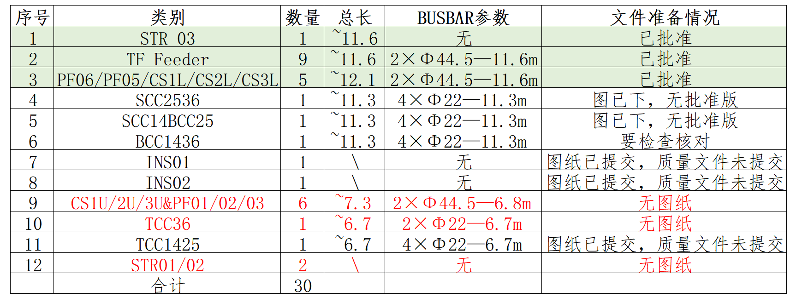

# CFT 2020 年工作评估

2020 年的 CFT 工作形式很严峻，主要存在**缺料**、**加工严重滞后**两大困难。

## CFT图纸质量完成情况

CFT 图纸及质量情况完成情况如下图所示，不影响 CFT 2020 年的生产计划，后续需要关注以下三个方面：

- 与所里沟通，尽快完成已提交文件的批准，陈祖兰负责；
- 本月内完成 INS01/02 两套质量文件的提交，陈祖兰和陈国超负责；
- 本年度完成剩余三套图纸的提交和批准，优先保证 CS1U ，陈国超负责；

## CFT 需求计划及 2020 年排产计划

CFT 共计 31 套，目前已完成 7 套 CFT,2020 年计划完成 8 套 CFT批量件及* 2 套 INS CFT *。

根据今天统计，下列是目前生产中的每套 CFT 遇到的困难。

### TF67 CFT

TF67 CFT 原计划完成时间是 4 月 10 日，目前来看预计会推迟 1 个月左右。主要的困难有：

- **外筒**-滑轨本周六才能完成机加工，加上后续的焊接、检测，要求** 3 月 14 日前必须完成**，翟雪娇负责；
- **VB** -VB外筒正在加工，同样妖气** 3 月 14 日前必须完成**，翟雪娇负责；
- **CAP**-**需要在 4 月 1 日前完成**，后续邹伟和杨回燕核对一下今年的 CAP 计划；
- **运输底架**-**需要在 4 月 1 日前完成**，后续邹伟提前 1 个月通知高川开始运输底架的生产；

### TF45 CFT

TF45 CFT 原计划的装配时间是完成时间是 4 月 1 日到 4 月 29 日，目前来看预计会推迟 1 个月左右。主要的困难有：

-**缺料**-花瓣支撑底板（ 12mm 厚 316L）,外筒法兰。解决方案是用目前厂里有的厚料代替，翟雪娇统计后交万艺和领导审核。

### 后续CFT存在缺料情况，目前采用两种方式，一是用家里现有料( PF6 归还料)代替；一是提回太钢生产料。

### 本年度两套 CC CFT 缺 32根 直径 21.3*2 316L 管，需要 4 月 1 日前借 35 根，万艺负责；

## 上航 CTB VB

目前已交货 8 套 CTB VB，正在加工 4 套，本月再下 4 套；
盘管已做到第 15 套；

