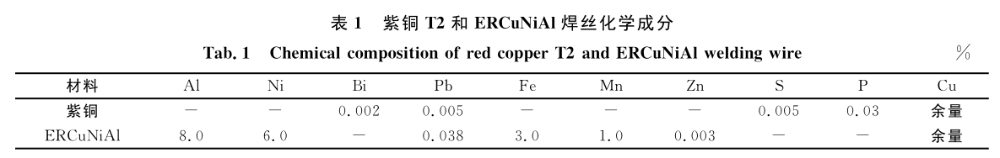
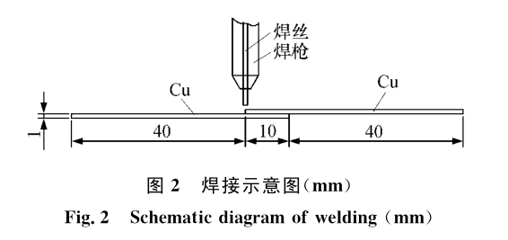

很难采购到小批量的异形超薄铜管，因此需要开发用超薄铜片卷制焊接工艺，其核心工艺就是超薄铜片的焊接问题。

紫铜具有良好的导电性、导热性、常温和低温塑性及耐腐蚀性，因而在工业中被广泛应用。关于铜及铜合金连接的研究较多，主要焊接方法有钎焊、焊条电弧焊、气体保护焊、埋弧焊、扩散焊等。

紫铜焊接有以下难点：
一是因为紫铜导热系数大，焊接时热量迅速传导出去，使母材和填充金属难于熔合；
二是其线膨胀系数大，导热能力强，热影响区宽，则会产生大的焊接应力， 易产生变形；
三是焊缝及近缝区易产生热裂纹；
四是易产生氢气孔。

# 激光焊

激光焊由于具有热量集中、热影响区小、焊后变形和残余应力小等优点。

激光焊接工艺

采用自行研制的专用夹具将两片焊接试样对接固定(装配时使两片试样对紧，不可留有间隙), 放在激光焊接工作台上进行焊接，如图 1 所示。激光设备
为 JHM-1GXY-300 型 Nb∶YAG 多功能激光器，最大输出功率为 300W。 焊接时采用纯氩进行保护。

在光斑直径、焊接速度一定的情况下，影响激光焊接接头性能的主要因素有脉冲工作电流、脉冲频率和脉冲宽度，因此正交实验主要通过调整这三个参数来研究焊接接头性能和微观组织。
在预试验时发现， 当脉冲工作电流小于 170A时会产生焊缝未焊合现象， 大于 190A 焊缝金属汽化严重、发生烧穿；减小脉冲频率可减少焊缝单位长
度的热量、有助于改善焊缝烧穿，但频率减少的同时降低了焊点之间的搭接量；脉冲宽度减小，单个脉冲传输给焊缝的热量也减少了，避免了烧穿的发生，但脉冲宽度过小，脉冲能量也缩小，容易导致未焊透。

（1） 通过实验优化设计得出了厚度为 0.1mm的超薄紫铜焊接电流为 190A、频率为 2.4ms、脉宽为 27Hz 为最佳的工艺参数。（2） 对焊缝的微观组织进行分析， 结果是焊缝边缘是细小的胞状晶，焊缝中心为等轴晶。（3） 在该实验中发现由于没有添加焊接材料，由于母材的液化蒸发及在重力作用下熔化金属下沉，焊缝表面出现凹陷，此现象会影响焊接接头的强度，因此后续试验可通过添加焊接材料解决该问题。

# 冷金属过渡技术

冷金属过渡技术CMT(Cold Metal Transer)是一种将送丝与熔滴过渡过程进行数字化协调的改进熔化焊方法。 通过协调送丝监控和过程控制实现了焊接过程中“ 冷” 和“ 热” 的交替。
ＣＭＴ同时具备许多优点，如焊接过程中，热输入量小、无飞溅起弧，减
少了焊后清理工作。能够进行薄板对接焊而不需要对工件进行背面气体保护 。

紫铜板是轧制态供货，晶粒细小； 镍铝青铜（ＥＲＣｕＮｉＡｌ）焊丝由于含有铝 元素和镍 元 素， 可能有多种相。

1) 由于冷金属过渡技术焊接过程中热输入少，几乎无飞溅，整个焊接过程采用高纯氩气保护， 因此焊缝成形美观，表面光亮， 焊后无需焊后处理。
 
2) 接头拉剪试样断裂位置在热影响区，断裂部位有颈缩现象，有很大的塑性变形． 接头的拉剪强度为1９５～ ２０４ＭＰａ ，可达到铜母材抗拉强度的８０ ％，满足实际应用．
３）镍铝青铜（Ｅ Ｒ Ｃ ｕ Ｎ ｉ Ａ ｌ ）焊丝可以作为紫铜－紫铜薄板焊接的填充金属．
４ ）接头断裂在铜热影响区，主要是由于热影响区在电弧热作用， 晶粒长大，致其软化引起．

